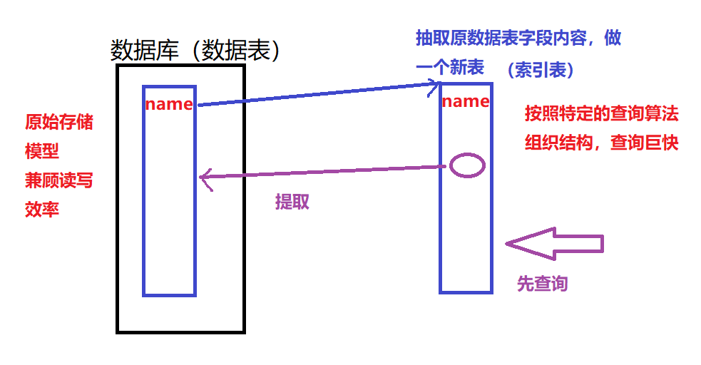
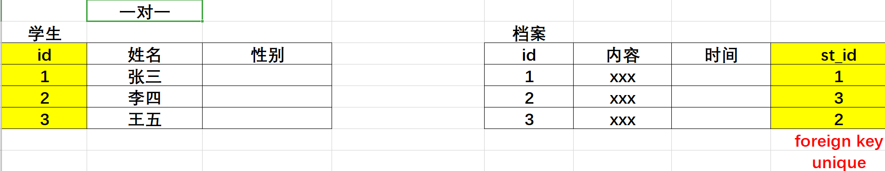
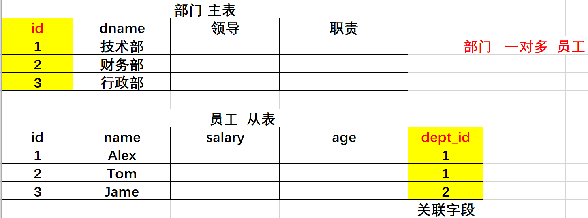
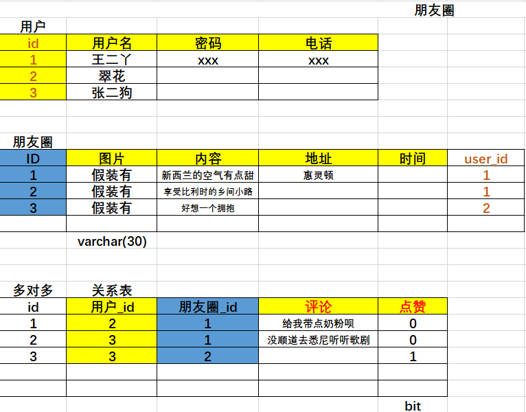

# 数据处理

| 班级：AID2007 |
| ------------- |
| 姓名：董鸭红  |

[TOC]

### 基本概念

#### 1 文件处理

###### 1.1 文件

+ 分类：文本     二进制
+ 字节串：二进制数据表达方式
  + str-->bytes   encode()
  + bytes-->str   decode()

###### 1.2 文件读写操作

+ open() --> read()/write() -->close()

     r  w   a   b  +

  > 注意：
  >
  > ​		1.以二进制方式打开文件，读取内容为字节串，写入也需要写入字节串
  >
  > ​        2.无论什么文件都可以使用二进制方式打开，但是二进制文件则不能以文本方式打开，否则后续读写会报错。

###### 1.3 细节

   * 缓冲区 ： 减少了和硬盘的交互次数，提高读写效率

              flush()  行缓冲

   * 文件的偏移量： 记录文件读写位置

              tell()  seek()

###### 1.4 OS模块

+ os.listdir()  获取文件列表

+ os.path.getsize()  获取文件大小

+ os.mkdir()    创建目录

  > 注意：返回值为none

+ os.path.exists()    判断文件是否存在

+ os.path.isfile()      判断文件类型

#### 2 正则表达式

###### 2.1 元字符

\*     .   ^   $   {n}   {m,n}  []   \d    \w   \W   \s   \S   \b

|      类别       | 元字符                                                 |
| :-------------: | :----------------------------------------------------- |
| 匹配字符（1个） | `.`   `[...]`   `[^...]`   \d   \D   \w   \W   \s   \S |
|    匹配重复     | `*`   `+`   `?`   `{n}`   `{m,n}`                      |
|    匹配位置     | `^`   $   \b   \B                                      |
|      其他       | `|`    ` ()`      ` \ `                                |


>注意： 
>
>​        1.当元字符符号与Python字符串中转义字符冲突的情况则需要使用r将正则表达式字符串声明为原始字符串，如果不确定那些是Python字符串的转义字符，则可以在所有正则表达式前加r。
>
>​		2. ^  和 $ 必然出现在正则表达式的开头和结尾处。如果两者同时出现，则中间的部分必须匹配整个目标字符串的全部内容。
>
>

###### 2.2 正则表达式规则

  * 贪婪模式 非贪婪模式   *  +   ？  {m,n}
   * 匹配特殊字符    \$ --> \\$
   * 子组 ：  (ab)+    (?P<name>xxxxx)


###### 2.3 re模块

+ 函数

     findall()  finditer()  search() match()

     match--> group()  span()

  > 注意：
  >
  > 		1. findall()如果正则表达式中没有子组直接得到匹配内容，遵循规则，只要你有子组，只能返回子组对应部分
  >
  >   		2. match()只能匹配开头，search()只能匹配一处，返回值都是match对象，所有match对象都只对应一处匹配内容，

```python
import re

# 目标字符串
s = "Alex:2000,Sunny:1999"
pattern = r"(?P<name>\w+):\d+"

# 正则表达式中有子组，则只能返回子组对应部分
result = re.findall(pattern,s)
print(result)  # ['Alex','Sunny']
```


+ flags参数扩展

  + A == ASCII  元字符只能匹配ascii码

  + I == IGNORECASE  匹配忽略字母大小写

  + S == DOTALL  使   可以匹配换行

  + M == MULTILINE  使 ^  $可以匹配每一行的开头结尾位置

  > 同时使用多个flag，可以用竖线连接   flags = re.I | re.A


#### 3 数据库

##### 3.1 数据库概述

+ 什么是数据库

  按照数据一定结构，存储管理数据的仓库。存储在某段介质上的数据

+ 优势

   数据一致性高，处理效率高，降低冗余，方便编程自动处理

+ 数据库管理系统 ：管理数据库的软件，用于建立和维护数据库。

+ 数据库分类 （关系 非关系 开源 不开源）

  * 关系型数据库特点 ： 表  字段  记录

+ mysql 特点 ：  开源  关系  中型  c/c++

+ mysql安装 

  + Ubuntu安装MySQL服务
    * 终端执行: sudo apt  install mysql-server
    * 配置文件：/etc/mysql
    * 数据库存储目录 ：/var/lib/mysql
  + Windows安装MySQL
    * 下载MySQL安装包(windows)  [https://dev.mysql.com/downloads/windows/installer/8.0.html](https://dev.mysql.com/downloads/windows/installer/8.0.html)
    * 直接运行安装文件安装

+ 启动和连接MySQL服务

  + 服务端启动
    * 查看MySQL状态 : sudo  service  mysql  status
    * 启动/停止/重启服务：sudo  service  mysql    start/stop/restart
  + 连接数据库

  ```
   mysql    -h  主机地址   -u  用户名    -p  
  ```


##### 3.2 SQL

不区分大小写，结尾用 ;

###### 3.2.1数据库

+ 创建数据库

    create database [db] charset=utf8;
    show databases;
    use [db];
    select database();
    drop database [db];

###### 3.2.2 数据表

+ 数据类型

  + 数字   tinyint   int   float  bit
  + 字符串  char   varchar   enum   set  text  blob
  + 时间    date  datetime  time   now()      支持比较大小、排序

+ 字段约束

  | 名称                         | 意义                                          |
  | ---------------------------- | --------------------------------------------- |
  | not null                     | 不能为空                                      |
  | default [val]                | 设置默认值                                    |
  | unsigned                     | 无符号，针对数字而言，指的是没有负数部分      |
  | primary key   auto_increment | 主键，如果主键为int类型，推荐用auto_increment |
  | comment [message]            | 注释                                          |

  

   create table [tb] (col type 约束,...);
     show tables;
     desc [tb];
     show create table [tb];
     drop table [tb];

  

###### 3.2.3 数据基础操作 （增删改查）

 insert into [tb] (col,..) values (xx,);

select col.. from [tb] where..

where子句：对行(记录)的筛选  算数    比较   逻辑

> 注意：比较不区分大小写， 如果需要区分字符串大小写 查询字段前增加 binary

   update  [tb]  set col=val,.. where

   delete from [tb] where...

###### 3.2.4 修改表结构

alter table [tb] add/modify/change..


##### 3.3 高级查询

+ 模糊查询 ： like    %  _

+ 重命名 ： as

+ 排序 ： order by

+ 限制（分页）: limit  offset

+ 联合查询 ： union 

  > 注意：
  >
  > ​        1.查询的字段数必须一样
  >
  > ​        2.如果order by只能放最后，表示对union后的内容进行排序

+ 子查询 ： from后作为数据提供者
              where中作为值的提供者

##### 3.4 聚合操作

+ 聚合函数： sum() max()  min() avg()  count()

> 注意：此时select 后只能写聚合函数，无法查找其他字段。

+ 聚合分组： group by [col]

> 注意： 
>
> 1.使用分组时select 后的字段为group by分组的字段和聚合函数，不能包含其他内容。group by也可以同时依照多个字段分组，如group by A，B 此时必须A,B两个字段值均相同才算一组。

+ 聚合筛选 ： having

> 1. having语句对聚合函数筛选，必须与group by联合使用。
> 2. having语句存在弥补了where关键字不能与聚合函数联合使用的不足,where只能操作表中实际存在的字段。

+ 聚合去重 ： distinct
+ 聚合运算


##### 3.5 索引操作

+ 什么是索引

  抽取原数据表字段内容，做一个新表，就是索引表。



+ 功能 ： 提高查询效率一种方法
+ 使用 ： 数据量比较大，而且经常查询操作
+ 分类 ： 普通   唯一   主键
+ 索引创建

```
   create table [tb] (
   col type primary key,
   col type unique,
   index [indexName](col),
   unique  [indexName](col)
   )

   create index [indexName] on [tb](col);

   desc--> MUL  PRI  UNI
   show index from [tb];

   drop index [indexName] on [tb];
```


##### 3.6 外键约束和表关联关系

###### 3.6.1 外键约束

> 注意：建立关系本身不需要外键

+ 作用：
     1.有的时候有关联的数据也不能放在一个表中，会冗余
     2.拆字段 分成不同的表 以降低冗余
     3.此时建立一个 关系字段，表达两表之前的数据关系
     4.为了约束关系字段的值和主从表之前数据的一致性，建立外键

+ 外键创建  

     > 注意：自动创建索引
     
     constraint [外键名]
     foreign key (外键字段)
     references 主表(主表主键字段)
     [级联动作]
     
     
     
      删除外键： alter table [tb] drop foreign key [fk_name]
     
      查看 ： show create table [tb]  


+ 级联动作
  * **restrict(默认) ** :  on delete restrict  on update restrict
    * 当主表删除记录时，如果从表中有相关联记录则不允许主表删除
    * 当主表更改主键字段值时，如果从表有相关记录则不允许更改
    * 当删除一条记录，应首先从关联表开始删除
  * **cascade** ：数据级联更新  on delete cascade   on update cascade

###### 3.6.2 表关联关系

+ 一对一  



+  一对多   



+ 多对多



+ E-R模型

  矩形框代表实体,菱形框代表关系,椭圆形代表属性

###### 3.6.3  表的关联查询

  内连接  tb1 inner join tb2 on 条件

  外链接  tb1 left join tb2 on 条件    
                       tb1 right join tb2 on 条件


##### 3.7 视图

视图是存储的查询语句


作用: 虚拟表 不会额外占有数据存储空间
        			操作视图就是操作原表数据

简化复杂操作，数据安全，结构清晰

   create or replace view [Name] as [Select]

   drop view [if exists] [view]

##### 3.8函数 和 存储过程

存储过程和函数是事先经过编译并存储在数据库中的一段sql语句集合。

+ 对比

  1.函数有且只有一个返回值，而存储过程不能有返回值。

  2.函数只能有输入参数，而存储过程可以有in,out,inout多个类型参数。

  3.存储过程中的语句功能更丰富，实现更复杂的业务逻辑，可以理解为一个按照预定步骤调用的执行过程，而函数中不能展示查询结果集语句，只是完成查询的工作后返回一个结果，功能针对性比较强。

  4.存储过程一般是作为一个独立的部分来执行(call调用)。而函数可以作为查询语句的一个部分来调用。

###### 3.8.1 函数创建

+ 函数创建

```mysql
   delimiter \$\$;  # 修改结尾符号，一般$$或//，目的方便定义函数

   create function func(uid int,...)  **returns** [return_type]
   begin
        函数体
        return  val
   end    $$

   delimiter  ;
```

> 注意：val只能是一个值，begin中语句必须以 ; 结尾。
>
> ​           函数不负责展示数据，所以不能直接写select ，写操作可以


```mysql
-- 函数不负责展示数据，所以不能直接写select ，写操作可以
create function st1() returns int
begin
    update cls set score=100 where name="Emma";
    return 1;
end $$

```

+ 局部变量定义 赋值

```mysql
--局部变量定义 (局部变量不要与查询的字段名重名)
-- 两种变量赋值方法
create function st2() returns int
begin
    declare max_score int;
    declare min_score int;
    set max_score=(select score from cls
    order by score desc limit 1);
    select score from cls
    order by score limit 1 into min_score;
    return max_score - min_score;
end $$
```

+ 含有参数的函数

```mysql 
delimiter $$
create function queryNameById(uid int)
returns varchar(20)
begin
return  (select name from cls where id=uid);
end $$

delimiter ;
```


###### 3.8.2 存储过程


   ```mysql 
create procedure proc(in uid int,...)
begin
      sql语句
end
   ```

+ 形参类型

   IN类型形参在使用过程中既可以传常量也可以传变量（用户变量），传入的值在存储内部可以直接使用，内部的修改不会影响外部。

  OUT类型形参必须传变量，传入的值在存储内部用不了的，但是可以修改，修改之后外部变量会随之发生改变。

INOUT类型形参传值时必须传变量，传入的值在内部可以使用，并且内部的修改会影响外部。

```mysql
create procedure st2(inout a int):
begin
   set a=888
end

set @a=10;

create procedure p_inout ( inout num int )
begin
    select num;
    set num=100;
    select num;
end $$

```


##### 3.9 事务控制

   * 事务 ： 一件事情的执行过程
   * begin  commit  rollback
   * 原子性  一致性  隔离性  持久性
   * 隔离级别 ： 读未提交  读已提交  可重复读  串行化


##### 3.10数据库优化

   数据表设计范式

   引擎的选择

   字段类型和键的设置

   sql语句的优化

   表的拆分


##### 3.11 数据库备份 用户和权限

+ 数据库备份

   create table [tb] select ....

   mysqldump .

+ 用户和权限

  create user
  drop user

   权限处理 ： grant    revoke

##### 3.12 pymysql

   打开 ： db = pymysql.connect()
          cur = db.cursor()

   读写数据 ： cur.execute()
             cur.executemany()

​     fetchone() fetchall()  fetchmany()

   commit()  rollback()

   关闭 ： cur.close()
          db.close()

### 小心得

##### 1.1 索引内部数据结构

   BTree(B树)  （聚簇索引和非聚簇索引）-- 主键就是聚簇索引

   Hash(哈希)    分组原则


### 小技巧

###### 1.1 大文件的读写

+ 思路：从源文件搞出内容，写入到新文件里边

​           * 如果文件比较大，循环的读写比较好？

​           * 循环读写时候什么时候结束？

+ 技巧

  大文件分批读取，data每次读取1024个字符

  读取到文件结尾继续读取会得到空字符串

