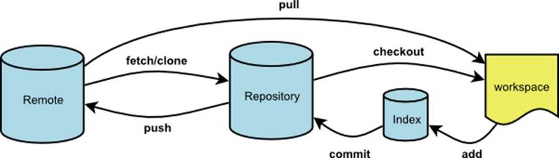
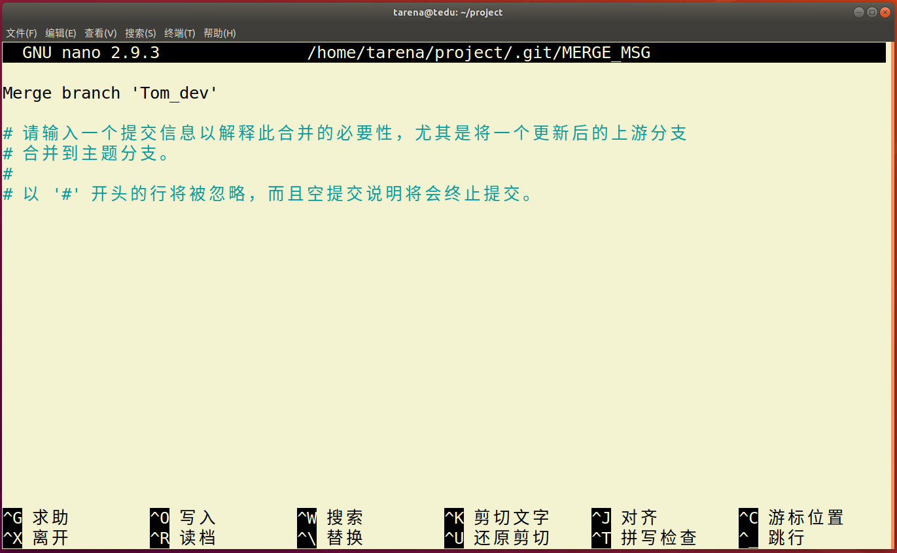
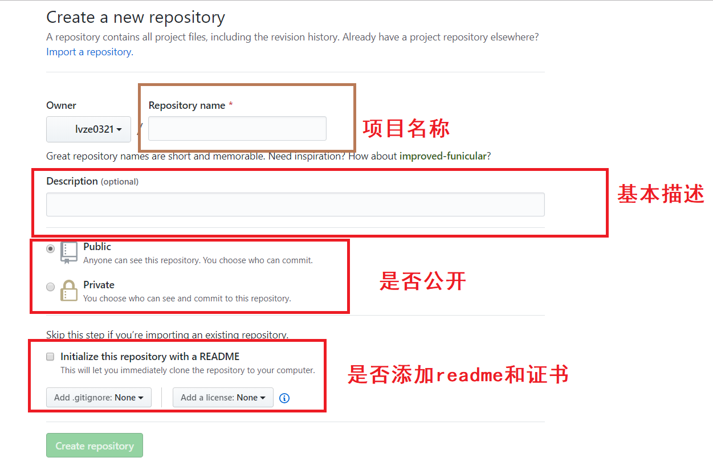

# GIT 代码管理工具

| 班级：AID2007 |
| ------------- |
| 姓名：董鸭红  |

[TOC]

#### 1 GIT概述

+ 什么是git?

  代码管理：svn  git  

  git是一种开源的分布式代码管理工具。

##### 1.1 代码管理工具作用

* 防止代码丢失，做备份
* 项目的版本管理和控制，可以通过设置节点进行跳转
* 建立各自的开发环境分支，互不影响，方便合并
* 在多终端开发时，方便代码的相互传输

综上所述，代码管理工具起到了备份、版本控制、多人协同以及代码传输作用。项目开发必备工具。


##### 1.2 特点

* git是开源的，多在*nix下使用，可以管理各种文件

* git是分布式的项目管理工具(SVN是集中式的)

* git数据管理更多样化，分享速度快，数据安全

* git 拥有更好的分支支持，方便多人协调

##### 1.3 Linux下GIT安装

> sudo apt  install  git


#### 2 GIT使用

##### 2.1  基本概念



* 工作区：项目所在操作目录，实际操作项目的区域
* 暂存区: 用于记录工作区的工作（修改）内容，像日志
* 仓库区: 用于备份工作区的内容
* 远程仓库: 远程主机上的GIT仓库

> 注意： 在本地仓库中，git总是希望工作区的内容与仓库区保持一致，而且只有仓库区的内容才能和其他远程仓库交互。-->及时备份


##### 2.2 初始配置

* 配置命令： git config --global [选项]

* 配置文件位置:  ~/.gitconfig

  

1.配置用户名

```
e.g. 将用户名设置为Tedu
sudo git config --global user.name Dongyh
```

2.配置用户邮箱

```
e.g. 将邮箱设置为yaya15545169266@163.com
git config --global user.email yaya15545169266@163.com
```

3.配置文件

```
 cat ~/.gitconfig
[user]
	name = Dongyh
	email = yaya15545169266@163.com
```


##### 2.3 基本命令

###### 2.3.1 初始化仓库

```
git init
意义：将某个项目目录变为git操作目录，生成git本地仓库。即该项目目录可以使用git管理
```

> 注意：创建一个空目录，init必须在主目录下执行，表示项目要管理的根目录。而不能在主目录下直接init。

```
e.g.
tarena@tedu:~/month02/project$ git init
```

###### 2.3.2 查看本地仓库状态

```
git  status
说明: 初始化仓库后默认工作在master主分支，当工作区与仓库区不一致时会有提示。
```

> 注意：必须在git仓库下

###### 2.3.3 将工作内容记录到暂存区

```
git add [files..]

e.g. 将文件 a ，b 记录到暂存区
git add  a b

e.g. 将所有文件（不包含隐藏文件）记录到暂存区,隐藏文件必须指定
git add  *(或者.)
```

###### 2.3.4 取消文件暂存记录

```
git rm --cached [file] 
```

###### 2.3.5 将文件同步到本地仓库

```
git commit [file] -m [message]
说明: -m表示添加一些同步信息，表达同步内容,不加file表示同步所有暂存记录的文件

e.g.  将暂存区所有记录同步到仓库区
git commit  -m 'add files'
```

使用pycharm也可以实现add  commit 操作

```
e.g
打开pycharm，在项目主目录下，创建新文件README.MD,弹框选择add添加到暂存区，点击右上角勾，弹框点击commit按钮。
右键git-->add-->commit
```

###### 2.3.6 设置忽略文件

在GIT项目中可以在项目根目录添加**.gitignore**文件的方式，规定相应的忽略规则，用来管理当前项目中的文件的忽略行为。.gitignore 文件是可以提交到公有仓库中，这就为该项目下的所有开发者都共享一套定义好的忽略规则。在.gitignore 文件中，遵循相应的语法，在每一行指定一个忽略规则。

```
.gitignore忽略规则简单说明

file            表示忽略file文件
*.a             表示忽略所有 .a 结尾的文件
!lib.a          表示但lib.a除外
build/          表示忽略 build/目录下的所有文件，过滤整个build文件夹；
```

取消pycharm git管理:file-->settings-->version control-->点减号

###### 2.3.7 移动或者删除文件

```
git  mv  [file] [path]
git  rm  [files]
注意: 这两个操作会修改工作区内容，同时将操作记录提交到暂存区。
 git commit -m 'rm and mv'  同步仓库区
```

###### 2.3.8 查看commit 日志记录

```
git log
git log --pretty=oneline
```

pycharm最下边version control-->点log  

###### 2.3.9 恢复文件

```
git checkout [commit] -- [file]

e.g. 将a.jpg文件恢复,不写commit表示恢复最新保存的文件内容
git checkout  --  a.jpg
```


##### 2.4 版本控制

###### 2.4.1 退回到上一个commit节点--在最近的几个版本跳转

```
git reset --hard HEAD^
说明： 一个^表示回退1个版本，依次类推。当版本回退之后工作区会自动和当前commit版本保持一致
```

###### 2.4.2 退回到指定的commit_id节点

```
git reset --hard [commit_id] 
说明：commit_id 取至少前7位id
```

###### 2.4.3 查看所有操作记录

```
git reflog
注意:最上面的为最新记录，可以利用commit_id去往任何操作位置
```

###### 2.4.4 创建标签

+ 标签: 在项目的重要commit位置添加标签，保存当时的工作状态，一般用于版本的迭代。解决跨版本较大

```
git  tag  [tag_name] [commit_id] -m  [message]
说明: commit_id可以不写则默认标签表示最新的commit_id位置，message也可以不写，但是最好添加。

e.g. 在最新的commit处添加标签v1.0
git tag v1.0 -m '版本1'
git tag v0.9 016457f -m '版本0.9'
```

+ 查看标签

```
git tag  查看标签列表
 git show [tag_name]  查看标签详细信息
```


+ 去往某个标签节点

```
git reset --hard [tag]
```


+ 删除标签

```
git tag -d  [tag]
```


##### 2.5 保存工作区

+ 保存工作区内容

```
git stash save [message]
说明: 将工作区未提交的修改封存，让工作区回到修改前的状态
```

+ 查看工作区列表

```
git stash  list
说明:最新保存的工作区在最上面
```


+ 应用某个工作区

```
git stash  apply  [stash@{n}]
e.g.
git stash apply stash@{1}
```

> 注意：还需同步仓库   git commit -m 'stash'

+ 删除工作区

```
git stash drop [stash@{n}]  删除某一个工作区
git stash clear  删除所有保存的工作区
```

##### 2.6 分支管理

###### 2.6.1 基本概念

+ 定义：分支即每个人在原有代码（分支）的基础上建立自己的工作环境，完成单独开发，之后再向主分支统一合并工作内容。

+ 好处

  + 各自开发互不干扰

  + 防止误操作对其他开发者的影响

    

###### 2.6.2 基本命令

+ 查看现有分支

```
git branch [branch_name]
说明: 基于a分支创建b分支，此时b分支会拥有a分支全部内容。在创建b分支时最好保持a分支"干净"状态。
```


+ 创建分支

```
git checkout [branch]
说明: 2,3可以同时操作，即创建并切换分支
```


+ 切换工作分支

```
git checkout [branch]
说明: 2,3可以同时操作，即创建并切换分支
```

> 注意： git checkout -b [branch_name]  可以同时完成创建分支和切换分支的工作

+ 合并分支

```
git merge [branch]
```

> 注意：分支的合并一般都是子分支向父分支中合并

+ 删除分支

```
git branch -d [branch]  删除分支
 git branch -D [branch]  删除没有被合并的分支
```


###### 2.6.3 分支冲突问题

* 定义： 当分支合并时，原来的父分支发生了变化，在合并过程中就会产生冲突问题，这是合并分支过程中最为棘手的问题。

* 冲突情形1—— 原来的分支增加了新文件或者原有文件发生了变化

  此时合并可能会出现:

  

​        此时只要先摁 **ctrl-o** 写入，然后回车，再摁**ctrl-x** 离开就可以了。

​         也可能出现提示让直行commit合并，那么此时只需要直行commit操作就可以了。这种冲突比较好解决。

+ 冲突情形2—— 子分支和父分支修改了相同的文件

  此时会出现：


​			这种冲突不太好解决需要自己进入文件进行修改后，再直行add ，commit操作提交

* 总结

  * 尽量在项目中降低耦合度，不同的分支只编写自己的模块。
  * 如果必须修改原来父级分支的文件内容，那么做好分工，不要让多个分支都修改同一个文件。

#### 3 GitHub使用

+ 远程仓库

  远程主机上的GIT仓库。实际上git是分布式结构，每台主机的git仓库结构类似，只是把别人主机上的git仓库称为远程仓库。GitHub可以帮助我们建立一个远程仓库。

+ GitHub介绍

  GitHub是一个开源的项目社区网站，拥有全球最多的开源项目。开发者通过可以注册网站账户，在GitHub建立自己的项目仓库（我们可以视作一个远程仓库）,GitHub规定GIT为它的唯一代码管理工具。

  GitHub网址：[github.com](https://github.com/)

##### 3.1 获取项目

+ 在左上角搜索栏搜索想要的获取的项目


+ 选择项目后复制项目git地址


+ 在本地使用git clone方法即可获取

```
git clone https://github.com/xxxxxxxxx
```


##### 3.2  创建自己的项目仓库

+ 点击右上角加号下拉菜单，选择新的仓库


+ 填写相应的项目信息即可



+ github仓库相对本地主机就是一个远程仓库通过remote连接


+ + 使用https链接

  ```
  # 后续操作每次上传内容都需要输入密码，比较麻烦，一般用于临时计算机的连接使用
  git remote  add origin https://github.com/xxxxxxxxx
  ```

  

  + 使用SSH连接

  ```
  # 先建立秘钥信任
  1. 将自己要连接github的计算机的ssh公钥内容复制
  2. github上选择头像下拉菜单，settings-》SSH and GPG keys-》new SSH key
  ```

  ​             将公钥内容添加进去，并且起一个标题名字，点击添加

  


```
 #后续无需输入密码，一般用于自己信任的计算机
  git remote add origin git@github.com:lvze0321/AID.git 
```

> origin代表远程仓库起的别名

+ 查看连接的远程仓库名称

```
git remote
```


+ 断开远程仓库连接

```
git remote rm [origin]
```


+ 如果是自己的仓库需要删除，则选择自己的仓库选择settings，在最后可以选择删除仓库。

img/


##### 3.3 远程仓库操作命令

+ 将本地分支推送给远程仓库

```
# 将master分支推送给origin主机远程仓库，第一次推送分支使用-u表示与远程对应分支	建立自动关联
git push -u origin  master

git push origin  [:branch]  # 删除向远程仓库推送的分支
```


+ 推送代码到远程仓库

```
# 如果本地的代码有修改项推送给远程仓库
git push
```


+ 推送标签

```
git push origin [tag]  推送一个本地标签到远程
 
git push origin --tags  推送所有本地所有标签到远程

git push origin --delete tag  [tagname]  删除向远程仓库推送的标签
```


+ 推送旧的版本

```
# 用于本地版本比远程版本旧时强行推送本地版本
git push --force origin  
```


+ 从远程获取代码

```
git pull
```


