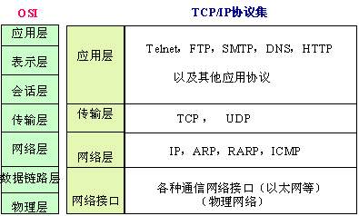
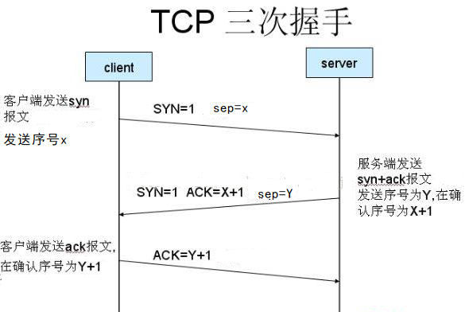
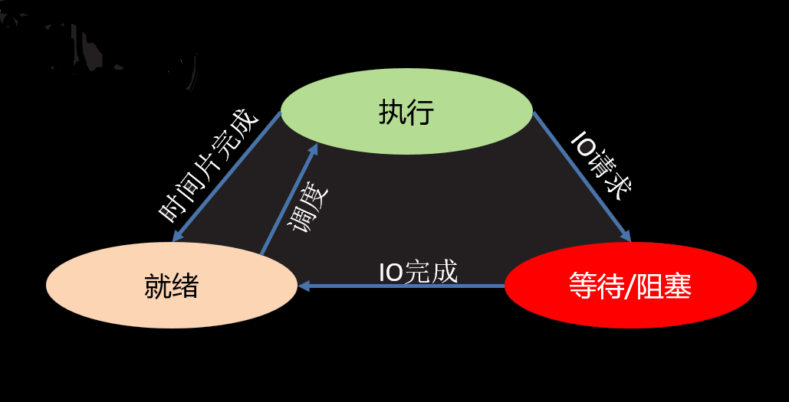

# 网络并发

| 班级：AID2007    |
| ---------------- |
| **姓名：董鸭红** |

[TOC]

### 基本概念

##### 1 网络编程

网路：数据传输、资源共享

###### 1.1 OSI 7层模型

+ 定义：是网络通信标准化流程

+ 具体描述

  ​			一共分为7层，自顶向下依次是应用层、表示层、会话层、传输层、网络层、数据链路层、物理层。

  + **应用层**：规定了具体实现应用程序的功能，如微信（聊天）、王者荣耀（游戏），只会告诉你要做什么，不会告诉你具体怎么做。确定应用功能就有消息。
  + **表示层**：数据压缩（传输的数据更少）优化加密。对消息进行处理。
  + **会话层**：应用级连接（通常是客户端与服务端连接，如有网络自动连接服务器），选择传输服务（数据不同，如视频音频，传输方式不同，最终要靠底层来提供服务（就2种））
  + **传输层**：提供传输服务，由系统模型帮我们实现的。
  + **网络层**：在网络传输中，逐层去查找正确的路径，将消息准确的传递到目的地。如包裹分段运输，看地图走路。通过网络硬件设备（路由、网卡、交换机）和网络工程师的配置。
  + **数据链路层**：将上层数据转化成二进制，将它进行分包
  + **物理层**：最终数据通过物理层传输（光纤 wiffi）

  

+ 好处/优势/特点

  + 建立了统一的通信标准
  + 降低开发难度，每层功能明确，各司其职，降低耦合
  + 七层模型实际规定了每一层的任务，该完成什么事情

+ 引申

  + 七层模型过于理想，结构细节太复杂，在工程中应用实践难度大，实际工作中以TCP/IP模型为工作标准流程

###### 1.2 TCP/IP模型

+ 定义：是工作标准流程

+ 具体描述

  ​	一共分为4层，自顶向下依次是应用层、传输层、网络层、网络接口。

  + **应用层**：将应用层、表示层、会话层合并成应用层，兼顾了三者功能，既负责功能的开发，又负责压缩优化加密，又负责选择传输服务
  + **传输层**：在系统层面，提供传输服务
  + **网络层**：路由寻址，通道选择
  + **网络接口**：将数据链路层、物理层合并成网络接口，负责数据的最终二进制转化，数据传输

  

###### 1.3 IP

+ 定义：即在网络中标识一台计算机的地址编号。
+ 特点
  + IPv4 特点
    * 分为4个部分，每部分是一个整数，取值分为0-255     
  + IPv6 特点

    * 分为8个部分，每部分4个16进制数，如果出现连续的数字 0 则可以用 ：：省略中间的0
+ 引申：IP 相关命令
  + ifconfig:查看Linux系统下计算机的IP地址
  + ping  [ip]：查看计算机的连通性 

###### 1.4 端口

+ 定义：网络地址的一部分，在一台计算机上，每个网络程序对应一个端口。
+ 特点
  + 取值范围： 0 —— 65535 的整数
  + 一台计算机上的网络应用所使用的端口不会重复
  + 通常 0——1023 的端口会被一些有名的程序或者系统服务占用，个人一般使用 > 1024的端口

###### 1.5 公网和内网

+ 公网IP指的是连接到互联网上的公共IP地址，大家都可以访问。（将来进公司，公司会申请公网IP作为网络项目的被访问地址）

+ 内网IP指的是一个局域网络范围内由网络设备分配的IP地址。比如路由器、交换机

  > 注意：同一局域网内网络设备IP地址不同，可以相互访问，但是不同局域网内网络设备不可以相互访问

###### 1.6 网络传输

###### 1.7 基于udp的编程

+ 定义：传输层的协议，在传输层提供传输服务

+ 创建udp套接字流程

    socket套接字

     服务端： socket()-->bind()-->recvfrom/sendto-->close()

     客户端： socket()--> sendto/recvfrom-->close()

  

+ 特点

  + 效率较高，使用简单方便，但是udp并不保证传输的可靠性，它是允许数据传输过程中产生丢包的。
  + udp传输自由

+ 应用

  对传输要求不高，允许消息丢失的，可能会用udp，比如游戏。\

###### 1.8 基于tcp的编程

+ 定义：传输层的协议，在传输层提供传输服务

+ 创建tcp套接字流程

  socket套接字

   服务端： socket()-->bind()-->listen(5)-->accept()-->recv/send-->close()

   客户端： socket() --------------------->connect()-->send/recv-->close()

  > 注意：
  >
  > ​		1.设置监听目的最主要功能将套接字设置为监听套接字，才能让tcp套接字被客户端连接，顺带创建监听队列。
  >
  > ​		2.监听队列数字：一般情况一个监听套接字可以连接的客户端数量1024个，这里的监听队列数字并不影响到套接字连接客户端数量，但能影响到我瞬时同时接收请求的数量，瞬时很难说，比如机子比较慢，我处理三次握手要0.01s，瞬时指0.01s，如果机子比较快，我处理三次握手只要0.001s，瞬时指0.001s。花0.01s处理一个客户端连接的同时，又有多个客户端同时进来了，把它们放在监听队列中，等我连接好了后，再拿下一个，如果同时有几百个，超过监听队列数量的会拒绝。

  

+ 特点

  + 安全性更高，三次握手、四次挥手以及内部的请求应答保障机制
  + 每次发送消息都需要重新建立套接字，发起链接，效率较低
  + tcp是以字节流的方式进行数据传输的，而且需要建立连接，需要listen accept连接机制，会产生粘包问题

+ 引申

  + recv() 链接端退出时会返回空字节串

  + 缓冲区和粘包

    + 粘包问题

      粘包指多次发送的内容，被一次性接收。原因：tcp以字节流方式进行数据传输，在接收时不区分消息边界，论字节数（流式套接字），直到缓冲区为空。

    

    + 防止粘包

      *人为的添加消息边界，用作消息之间的分割  比如使用 '##'

      *控制发送的速度 增加延迟，大批量发送不建议  比如sleep(0.1)

+ 应用
  
  + 对传输要求比较精确的，一般使用tcp，比如邮箱、文件传输


###### 1.9 首部

###### 1.10 三次握手

+ 定义：三次握手是tcp数据传输之前建立连接的过程

+ 具体描述

  

  首先客户端发送连接请求（SYN特殊的变量标志，是在tcp传输层的首部信息中，附加在应用层外围），服务端收到后，根据tcp协议规定，它收到的首部中包含SYN=1就表示有客户端要连接它，如果服务端允许连接，给客户端回复，回复中最主要的是ACK应答标志，它把ACK置成了对方发过来的数字加1这样的方式，然后告诉对方我同意了；客户端收到回复，发送最终的标志，建立起连接。

+ 好处/优势：从连接角度，保证消息传输的可靠性

+ 应用

  我们平时用套接字来编程，如果选择的是tcp，提前在系统内部建立三次握手过程，这一过程我们并没用做什么，只是选择了传输服务。

###### 1.11 四次挥手

+ 定义：四次挥手是断开连接的过程

+ 具体描述

  先是主动方给被动方发送一个Fin请求断开连接，与此同时会发送一个随机值（X），被动方接受到这个请求后，开始第二次挥手，会立即回复一个ACK应答，告知它我已经收到了你的请求了，然后准备开始断开，需要一段时间准备，第三次挥手还是被动方发送发送一个Fin请求断开连接，与此同时会发送一个随机值（Y），表示可以断开连接，当主动方收到回复后，主动方发送确认标志（ACK）,表示断开连接。

###### 1.12  HTTP协议   请求响应

+ 什么是HTTP协议（超文本传输协议）？超文本指各种格式数据

  它是应用层协议，传输数据的协议  特点：无状态  简单   请求类型多

+ 网页的获取过程

  1.从地址栏输入域名（IP起的别名，绑定公网IP），通过域名解析DNS,得到服务器地址，如果本地有记录，不一定需要通过解析器DNS，浏览器会组织请求数据（http格式），建立tcp连接，将请求发送给服务器，最终会将组织的请求发送给服务器。-- HTTP请求

  2.服务器有webserver程序（只负责解析），webserver接收请求，按照协议进行基本的解析请求（规约），得知你想要什么，把请求交给后端程序，负责进行逻辑处理、数据计算、IO处理等等，可能还会用到数据集，比如：数据库、静态文件，这一过程中有可能于数据库、静态文件交互。

  3.经过处理后得到结果，组织为http格式响应，发送给浏览器。-- HTTP响应

  4.浏览器接收响应，解析数据，数据呈现为网页页面。

，

+ HTTP协议的格式

  + http请求格式

     请求格式: 请求行 请求头 空行 请求体

     **GET  /  HTTP/1.1**

  + http相应格式

       响应格式: 响应行 响应头 空行 响应体

     **HTTP/1.1  200  OK**
  
  > 注意：换行  \r\n

##### 2 多任务编程

###### 2.1 多任务编程

+ 多任务编程： 程序启动后可以同时执行多个任务 （多进程  线程）
+ cpu 轮询机制：逐个访问   
+ 多核cpu：多个单核cpu集合  
+ 并发和并行： 并发指多个任务如果被分配给了一个cpu内核，并行指多个任务如果被分配给了不同的cpu内核。
+ 好处：  充分利用计算机资源，提高了任务的执行效率。在任务中无阻塞时只有并行状态才能提高效率，在任务中有阻塞时并行并发都能提高效率。

###### 2.2 进程

+ 进程概念

  + 进程：进程是一个过程，任务执行的过程， 占有运行资源。

  + PID：操作系统分配给进程的编号,大于0的整数，系统中每个进程的PID都不重复。

  + 进程状态

    + 三态

      就绪态 ： 进程具备执行条件，等待系统调度分配cpu资源  进程已经创建好了，等待系统分配CPU资源，宫斗戏中女主刚进宫

      运行（执行）态 ： 经过操作系统（皇上身边太监）调度，进程占有cpu正在运行   时间片：进程占有CPU时间，不占有CPU叫时间片完成

      等待态 ： 进程阻塞等待，此时会让出cpu，女主被打入冷宫



+ 
  + 父子进程：在Linux操作系统中，进程形成树形关系（pstree），任务上一级进程是下一级的父进程，下一级进程是上一级的子进程。
  + 孤儿进程： 父进程先于子进程退出，此时子进程成为孤儿进程。
  + 僵尸进程：子进程先于父进程退出，父进程又没有处理子进程的退出状态，此时子进程就会成为僵尸进程。

+ 特点
  + 子进程复制父进程全部内存空间代码段，子进程只执行指定的函数。
  + 进程间空间独立，资源不共享，进程间通讯使用消息队列。
  + 进程的创建和销毁过程消耗的资源较多。
  + 进程也是多任务编程方式，能使用计算机多核资源。
  + multiprocessing 创建的子进程中无法使用标准输入（input）。

###### 2.3 创建进程、进程属性及自定义进程类

+ 创建进程

```python
p = Process()
p.start()
p.join()
```

> 注意 : 启动进程此时target绑定函数开始执行，该函数作为新进程执行内容，此时进程真正被创建

+ 进程属性

```python
 p.daemon=True  #子进程随父进程退出  
```

> 注意：在start之前使用,通常不与join一起使用


```python
sys.exit(info)
功能：退出进程
参数：字符串 表示退出时打印内容
```


+ 自定义进程类

```python
   继承Process
   重写__init__,super()加载父类__init__
   重写run方法
```


###### 2.4 进程池技术

+ 解决问题: 解决进程频繁创建销毁带来的计算机压力

  ```python
     Pool()
     apply_async()
     close()
     join()
  ```

###### 2.5 消息队列

+ 通信原理： 在内存中开辟空间，建立队列模型，进程通过队列将消息存入，或者从队列取出完成进程间通信。

```python
   Queue()
   q.put()
   q.get()
```


###### 2.6 线程

+ 定义

  多任务编程方法
   运行过程-->占有资源-->共享进程资源
   轻量级的进程--> 包含关系

+ 特点

  轻量级的进程，线程的创建销毁需要的系统资源较少。

  线程是共享进程资源，系统不会单独给线程分配资源。

  线程也是多任务编程方式，能使用计算机多核资源。Python线程存在GIL问题,C在解释python线程代码时，同一时刻只能一个线程,python的线程不能并行，所以多核资源也没什么用.

+ 延申

  * GIL问题与Python语言本身并没什么关系，属于解释器设计的历史问题。
  * 在无阻塞状态下，多线程程序程序执行效率并不高，甚至还不如单线程效率。
  * Python多线程只适用于执行有阻塞延迟的任务情形。

###### 2.7 创建线程、线程属性及自定义线程类

+ 创建线程

```
threading --> Thread()  start()  join()
```

+ 线程属性

```python
t.setDaemon(True) #分支线程随主线程退出  
```

> 注意：在start之前使用,通常不与join一起使用

+ 自定义线程类

```
   继承Thread
   重写__init__,super()加载父类__init__
   重写run方法
```


###### 2.8 线程同步互斥

+ 定义

  原本对共享资源的操作是无序的行为，怎样利用同步互斥方法成为有序，同步指相互之间按照一定顺序执行，互斥就是各自抢占，抢占后让别的线程无法用，为什么能让别人无法用，无论协同还是阻塞，都是强加阻塞，来达到别人无法使用。

+ 优缺点

  好处：可以控制多个线程对共享资源的无序使用

  缺点：提供阻塞必然会降低效率（换取数据的正确性），当逻辑混乱时容易产生死锁问题。

+ 应用t

  + Event()  e.set()  e.clear()  e.wait()

  + Lock()   lock.acquire()  lock.release()

  ​         我们用来做什么：只要开发中用到线程，在资源共享上都要用到同步互斥方法，多线程都要用到它，除非你每个线程独立设置变量，独立开辟资源，比如在函数里边创建局部变量，自定义类里设置属性。

###### 2.9  GIL问题

+ GIL（全局解释器锁）定义

  ​       C解释器在帮助python解释线程过程中也要进行系统资源的调用，当C解释器在用系统资源的时候，就发现了，本身C解释器也要创建线程，但是就遇到了使用系统资源同步互斥情况，使用同步互斥方法加锁，C解释器加锁，注意是在解释器层面，它是为了防止==在解释python的过程中对系统资源的争夺==，跟应用层没太大关系。

+ 影响

  C在解释python线程代码时，同一时刻只能一个线程

+ 建议

  * 尽量使用进程完成无阻塞的并发行为

  * 不使用c作为解释器 （Java  C#）

  + Guido的声明：<http://www.artima.com/forums/flat.jsp?forum=106&thread=214235>

+ 结论 
  * GIL问题与Python语言本身并没什么关系，属于解释器设计的历史问题。
  * 在无阻塞状态下，多线程程序程序执行效率并不高，甚至还不如单线程效率。
  * Python多线程只适用于执行有阻塞延迟的任务情形。

###### 2.10 进程线程的区别联系

* 区别联系

1. 两者都是多任务编程方式，都能使用计算机多核资源
2. 进程的创建销毁消耗的计算机资源比线程多
3. 进程空间独立，数据互不干扰，有专门通信方法（如消息队列）；线程使用全局变量通信
4. 一个进程可以有多个分支线程，两者有包含关系
5. 多个线程共享进程资源，在共享资源操作时往往需要同步互斥处理
6. Python线程存在GIL问题，但是进程没有。

* 使用场景

1. 任务场景：一个大型服务，往往包含多个独立的任务模块，每个任务模块又有多个小独立任务构成，此时整个项目可能有多个进程，每个进程又有多个线程。
2. 编程语言：Java,C#之类的编程语言在执行多任务时一般都是用线程完成，因为线程资源消耗少；而Python由于GIL问题往往使用多进程。

##### 3 多任务并发模型

###### 3.1 多任务并发模型概述

+ 定义

  多任务并发模型具体指多进程多线程网络并发模型，同时能够应对多个访问请求，即每当有一个客户端链接进来 就为其开启一个新进程或者线程，多任务并发模型也是实际工作中最为常用的服务端处理模型。

+ 优点： 能同时满足多个客户端长期占有服务端需求，可以处理各种请求。

+ 缺点： 资源消耗较大

+ 适用情况：客户端请求较复杂，需要长时间占有服务器。

###### 3.2 多进程并发模型

* 创建网络套接字用于接收客户端请求
* 循环等待客户端连接
* 为连接来的客户端创建新的进程，具体处理客户端请求
* 处理僵尸进程，设置子进程随父进程退出
* 如果服务端退出，做异常处理。


###### 3.3 多线程并发模型

* 创建网络套接字用于接收客户端请求

* 循环等待客户端连接

* 为连接来的客户端创建新的线程类（自定义类），具体处理客户端请求

* 设置分支线程随主线程退出

* 如果服务端退出，做异常处理。

  

###### 3.4 IO并发模型

+ 什么是IO

  输入和输出，读行为称之为输入，写行为称之为输出。读行为指程序运行时从别的地方把数据读到程序里，写行为指程序里的数据传达给别人，把它写到别的地方。在我们内存当中，存在有一定数据交换的行为，一般都是IO行为。

  + IO密集型 : IO操作多  特点：cpu消耗少  耗时长--IO操作本身就耗时长，跟硬盘、网络的交互耗时长，另外经常出现阻塞。
  + 计算密集型 : 计算多   特点：cpu消耗大  耗时短 -- 无阻塞，cpu性能不错，一般情况硬盘、网络性能跟不上cpu。
    + 提高计算密集型执行速度：     依赖硬件提升（cpu、gpu），依赖强大的算法

+ IO模型

  + IO 阻塞IO : 默认形态  效率低  简单。遇到不满足条件情况就阻塞，停止执行。

    

    阻塞情况

    * 因为某种执行条件没有满足造成的函数阻塞 -- 可以从这方面提高程序执行效率
      e.g.  accept   input   recv
    * 处理IO的时间较长产生的阻塞状态--依赖硬件提升
      e.g. 网络传输，大文件读写

  + 非阻塞IO 

    + 非阻塞指IO利用原本应该阻塞的时间，去做一些没有关联性的事件，而不必在这死等，浪费时间。

    + 适用场景：配合IO多路复用，设置非阻塞IO

      setblocking(False)

    

    

    

+ IO多路复用

  1.什么是IO多路复用

  同时监控多个IO，哪个IO准备就绪，告知应用层，让应用层通过遍历获取到这个IO对象后，进行对应操作。它并没有占用计算机多核资源，它仍本质上是单进程，不需要额外的开辟进程线程，它能真正做到同时执行多个任务吗？，在微观上能真正做到同时吗？其实不能，因为你是一个单进程程序，只占有一个cpu内核，从严格意义上讲它并不能真正做到同时，但是从应用层观察的角度，感受这些IO能随时处理，它的同时是能够处理多个IO行为，只适用于大量IO请求情况。

  

> 注意：
>
> ​		1.利用操作系统帮我们监控IO，监控的是对象，比如生成的套接字对象、文件对象，而不是行为
>
> ​		2.应用层依赖操作系统，应用层将IO事件交给操作系统，让操作系统帮我们进行所谓的IO监控，前提条件操作系统有IO多路复用功能，帮你轮询监控，哪个IO准备好，把就绪的IO交给应用层执行。
>
> ​		3.就绪：已经必然发生，比如input客户端写好回车，IO事件交给应用层，行为不会阻塞。

2. IO多路复用方法

   思考：利用IO多路复用方法完成对多个客户端的同时掌控，循环的网络模型中为什么不能同时处理多个客户端呢？

   ​	在循环模型当中，先创建了套接字，然后在当中做两件事，第一个进行连接（S.accept()），第二个处理客户端请求,主要原因是处理客户端请求，如果处理客户端请求比较耗时（通过连接套接字收发消息），这段时间内你没办法再回到accept继续接受下一个客户端连接，没有办法完成同时应对多个客户端，把它看成2个IO事件，用IO多路复用方法，系统监控S  C ，初始就是S，如果有客户端就绪，就告知应用层，用这个方法（c,addr=S.accept()）去处理，处理完还监控S,注意每连接一个客户端生成一个客户端对应连接套接字，监控C,如果又有客户端连接，我再用这个方法（c,addr=S.accept()）去处理，又产生了一个新的客户端连接套接字，监控C1;如果C发消息了，C就绪了，我用第二个方法处理。

   ​		利用IO多路复用系统监控原理，我可以同时监控这些IO行为，原本它们是有先后顺序的，必须先连接才能收发消息，而且在执行上有顺序关系，但是通过系统监控这些IO，我就把这些关系平等化，哪个准备就绪我就调用相应的方法处理哪个，不具备先后性的，实际上是一种调用

   ​       

   + select :   select()
   + poll : p = poll()  p.register()
               p.unregister()  p.poll()
   + epoll

 3.IO 多路复用三种方法对比

+ **select** （重点）  

  + 优势
    + 支持的操作系统最多 win Linux unix
    + 同时监控IO数量  1024
    + 执行效率 一般   

+ poll （了解）    

  + 优势
    + 支持 Linux Unix
    + 同时监控IO数量无限制
    + 执行效率 一般

  + 刨析内部原理

    ​		先在应用层把关注的IO整理好后，当你调用select方法或poll方法，会把你关注的IO提交给系统层，让操作系统层进行监控，这个提交在它内部叫IO的映射（把IO放到系统层），采用轮询（快速的逐个访问）的方法帮我们监控这些IO，系统层发现某个IO就绪，此时它会告知应用层你所关注的这些IO中有IO准备就绪，请处理，但是并没有告诉应用层是哪个IO准备就绪。而作为应用层，它需要经过遍历确认的过程，它需要把这些IO遍历一遍，最终确认原来是这一个IO就绪了，把它作为返回值返回给程序，在应用层去处理，处理完后，每次调用select和poll,还需要将关注的IO重新映射到操作系统层，系统层不会把之前的保留的。

  

+ **epoll**（重点）   

  +  优势
    + 支持 Linux
    + 同时监控IO数量无限制
    + 执行效率 较高       
      *关注的IO直接放在系统层申请的空间
        不必每次监控都向系统映射

  ​                             *当有IO就绪会直接得知是哪一个,而不必
  ​                                   在应用层遍历确认

  + 刨析内部原理

    ​		应用层关注的IO 直接提交给系统层，使用register函数实现的，在epoll中发现这个IO比较好，让系统帮助我们监控，通过register直接在系统层开辟空间，然后把这个IO直接就存留在系统层所开辟的空间中，当你调用poll方法，此时系统层帮我们轮询监控，在轮询过程中发现有IO准备就绪，那么此时会直接告知应用层，在应用层中直接把它作为返回值返回，然后直接使用，省去了最后的轮询查找。当循环回来，再次发起监控，不会再在其他任何事，直接告知系统层你再 帮我监控一次，而不会说这些IO重新往系统层添加一遍，也就是说通过register一次注册，就永久生效，除非你通过unregister删了或你的程序结束，不必每次监控都向系统层映射。

  

#### 小心得

###### 1.1  cookie :  理论问题小心得

这是什么  具体描述  好处/优势/特点  引申  我用它干什么

###### 1.2 cookie:代码训练: 群聊聊天室  ftp文件服务   webserver

* 思考方法 : 每个功能独立的列逻辑
        在使用角度去决定类的编写模型

        总分的请求处理模型
        自定义简单的通信协议
        请求应答情况分类讨论
    

#### 小技巧

##### 1网络编程

###### 1.1  客户端退出后服务端不退出

+  思考1：如何修改能让客户端退出后服务端不退出，继续处理下一个客户端的链接

  > 小技巧：recv() 链接端退出时会返回空字节串

  ```python
      # 收发消息
      while True:
          # 链接的另外一端结束 此时 recv会返回空字节串
          data = connfd.recv(5)
          # 收到##或者data为空字节串时 表示客户端结束
          if not data or data == b"##":
              break
  ```

###### 1.2 防止粘包

+ 思考2：使用tcp循环发送如何防止粘包

  > 小技巧：添加消息边界    添加延迟

  ```python
      def do_list(self):
          # 判断文件库是否为空
          file_list = os.listdir(FTP)
          if not file_list:
              self.connfd.send(b'FAIL')
              return
          else:
              self.connfd.send(b'OK')
              time.sleep(0.1)  # 防止粘包
              # 使用\n做消息边界,拼接文件列表
              data = '\n'.join(file_list)
              self.connfd.send(data.encode())
  ```

  

##### 2 多任务编程

###### 2.1 处理僵尸进程

+ 思考1：处理僵尸进程

  > 小技巧：在父进程中使用signal方法处理

  ```python
  from signal import *
  signal(SIGCHLD,SIG_IGN) # 处理僵尸进程
  ```

###### 2.2 子进程随父进程退出

+ 思考2：如何能让子进程会随父进程的退出而结束

  > 小技巧：在start之前daemon设置为True  

  ```
   # 为连接进来的客户端创建新的进程
          p = Process(target=handle,args=(connfd,))
          p.daemon = True # 子进程随父进程退出
          p.start()
  ```

> 注意：线程中使用时，t.setDaemon(True)


